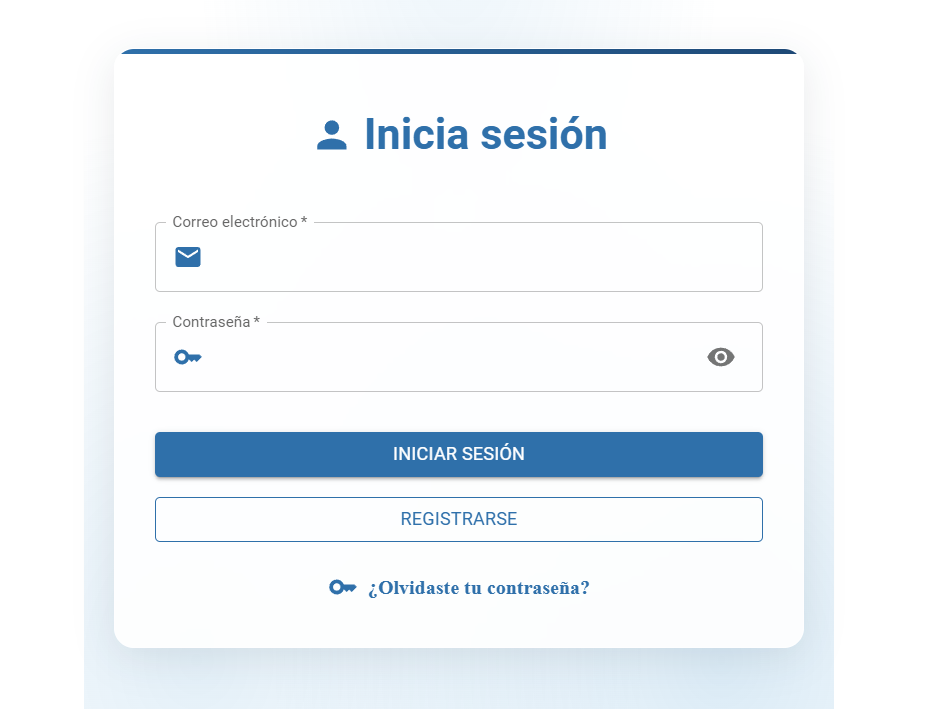
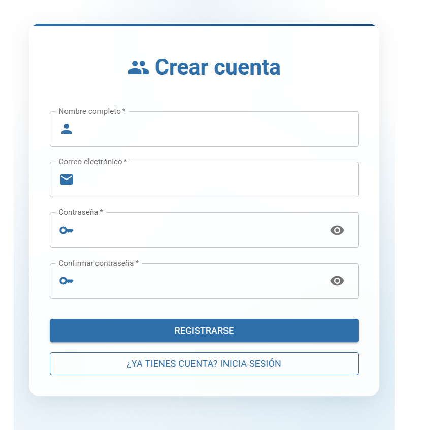
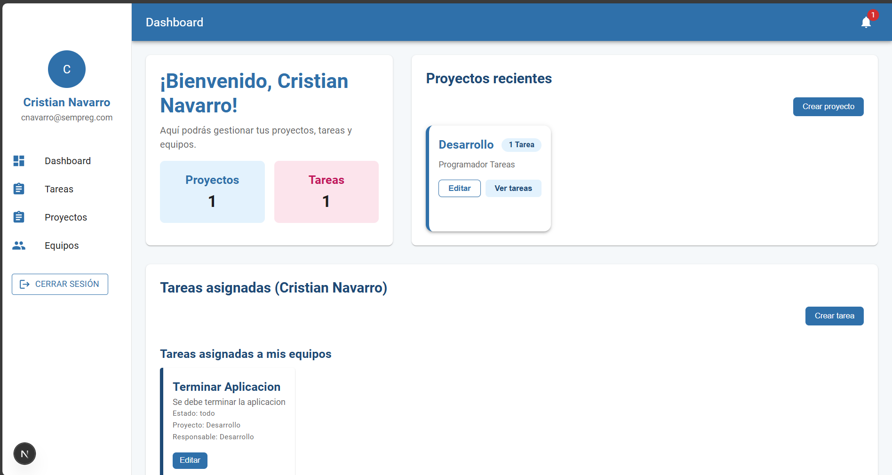

# Descripción del Proyecto
Este es un sistema de gestión de tareas para equipos de trabajo, diseñado para facilitar la colaboración y el seguimiento de proyectos. Los usuarios pueden crear proyectos, asignar tareas, agregar comentarios y colaborar de manera eficiente. La aplicación está construida con NestJS para el backend y Next.js para el frontend, utilizando una arquitectura de microservicios.

# Características Principales
## Gestión de Proyectos
Crear nuevos proyectos y asignar tareas.

Visualizar la lista de proyectos existentes.

Acceder a la página de detalles de cada proyecto y ver sus tareas asociadas.

## Gestión de Tareas
Crear tareas dentro de un proyecto, especificando:

Título, descripción, fecha límite, estado y responsable.

Editar tareas existentes.

Asignar tareas a un usuario o equipo.

Marcar tareas como completadas y, si es necesario, restablecerlas al estado anterior.

Eliminar tareas.

## Colaboración y Comentarios
Comentar en las tareas para discutir detalles y actualizaciones.

Recibir notificaciones sobre nuevos comentarios en tareas en las que el usuario participa.

## Filtros y Búsqueda
Filtrar tareas por estado, fecha límite, responsable, etc.

Buscar tareas por palabras clave.

## Autenticación y Autorización
Implementación de autenticación basada en tokens JWT.

Solo usuarios autenticados pueden acceder y gestionar proyectos y tareas.

Roles de usuario (administrador, miembro de equipo) con diferentes niveles de permisos.

# Requisitos Técnicos
## Backend:

Desarrollado con NestJS, utilizando una arquitectura de microservicios.

Autenticación mediante JWT para gestionar sesiones y acceso seguro a los recursos.

Base de datos relacional (por ejemplo, PostgreSQL o MySQL) para almacenar los proyectos, tareas y usuarios.

## Frontend:

Desarrollado con Next.js.

Interfaz de usuario utilizando Material Design.

Comunicaciones con el backend mediante peticiones HTTP REST.

## Estructura del Proyecto
Este proyecto está dividido en dos partes principales: el backend y el frontend.

### Backend
Microservicios:

Autenticación: Servicio de autenticación con JWT.

Gestión de Proyectos y Tareas: Servicio principal para la creación, modificación, eliminación y visualización de proyectos y tareas.

Comentarios y Notificaciones: Microservicio para la gestión de comentarios y notificaciones en tareas.

Tecnologías:

NestJS.

TypeORM/Sequelize para la gestión de la base de datos.

JWT para la autenticación.

PostgreSQL/MySQL para la base de datos.

### Frontend
Next.js: Framework para la construcción del frontend.

Tailwind CSS: Para un diseño rápido y responsivo.

NextUI/Headless UI: Componentes de interfaz de usuario para mayor accesibilidad y diseño atractivo.

Axios: Para realizar las peticiones HTTP al backend.

# Instalación
Sigue estos pasos para ejecutar el proyecto en tu entorno local:

## 1. Clona el repositorio
bash
Copiar
git clone https://github.com/cdnavarroa/Prueba-Tecnica.git
cd Prueba-Tenica
## 2. Configuración del Backend
### 2.1. Navega al directorio del backend:
bash
Copiar
cd backend
### 2.2. Instala las dependencias:
bash
Copiar
npm install
### 2.3. Configura las variables de entorno
Crea un archivo .env en la carpeta raíz del backend con las siguientes variables:

env
Copiar
DB_USER= "root"
DB_PASSWORD= ""
DB_NAME= "prueba_tecnica"
DB_HOST= "localhost"
DB_DIALECT= "mysql"
DB_PORT= "3306"
PORT= "8080" 
JWT_SECRET=supersecreto

## 3. Configuración del Frontend
### 3.1. Navega al directorio del frontend:
bash
Copiar
cd frontend
### 3.2. Instala las dependencias:
bash
Copiar
npm install
### 3.3. Configura las variables de entorno
modificar el next.config.mjs siguiente variable:

env: {
        BACKEND_URL: 'http://localhost:3001', // Aquí va la URL del backend
    },

# 4. Inicializacion del proyecto

Nos regresamos a la carpeta inicial

cd .. 

y ejecutamos pnpm run dev, esto deberia iniciar los dos repositorios al mismo tiempo si no hay ningun problema

nos deberia cargar la siguiente pantalla

Login

Registro

Por defecto deje que los usuarios se crearan como admin

una vez nos hallamos registrado e iniciemos sesion nos encontraremos con la siguiente pantalla, donde podran gestionar las tarea y proyectos

desde el menu podran acceder a las diferentes vistas donde veran de manera mas detallada cada una de las opciones

Uso
Autenticación: Usa el sistema de autenticación basado en JWT para iniciar sesión o registrar usuarios.

Crear Proyectos: Como administrador, puedes crear proyectos desde la interfaz de usuario y asignarles tareas.

Gestionar Tareas: Los usuarios pueden ver las tareas, asignarse tareas, y marcarlas como completadas.

Colaboración: Los usuarios pueden comentar en las tareas y recibir notificaciones de nuevos comentarios.